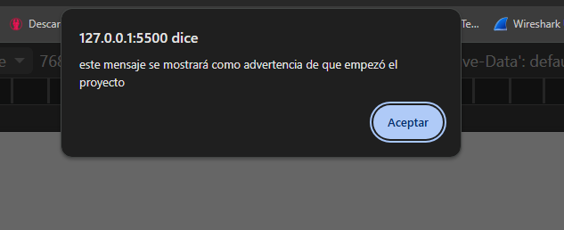
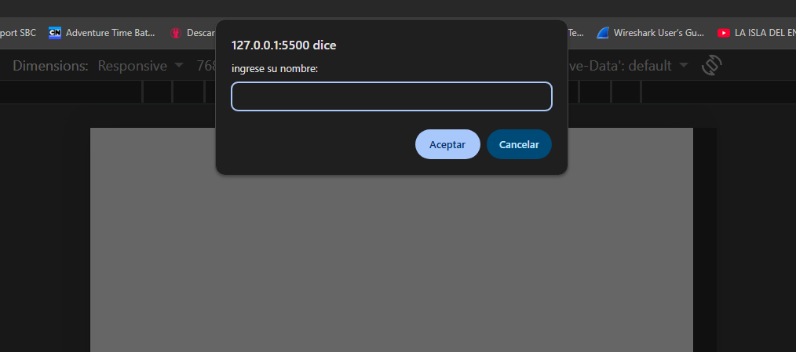
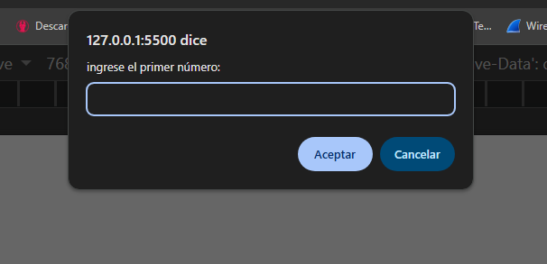
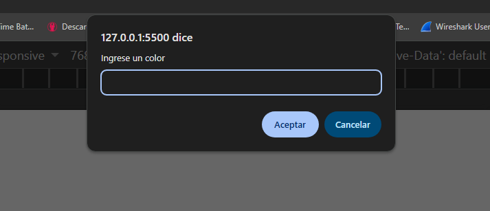
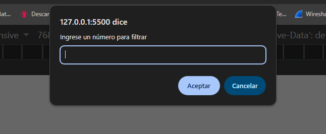
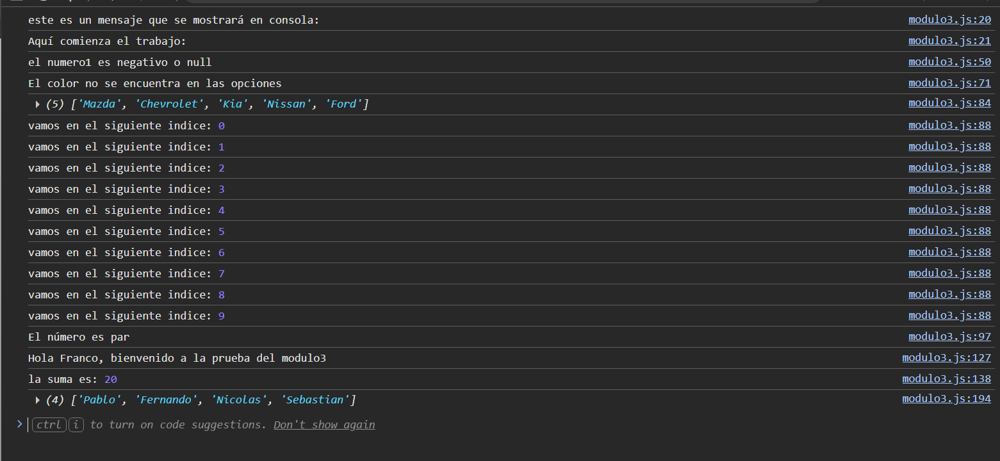

## Descripción del Trabajo.
* Este proyecto fue desarrollado como práctica de los conceptos fundamentales de JavaScript. Su objetivo es demostrar el uso de variables, operadores, estructuras de control, funciones, arreglos y objetos mediante distintos ejercicios ejecutados desde la consola del navegador.
* La aplicación solicita información al usuario mediante prompt, muestra mensajes utilizando console.log y alert, y realiza diferentes operaciones para reforzar los contenidos vistos durante el módulo.
* Utilización de condicionales, bucles además de arreglos y objetos, para la vizualización de lo aprendido en clases.

## Capturas de pantalla

A continuación se muestran algunas capturas del funcionamiento del programa durante su ejecución.

### 📢 Mensaje de alerta al usuario

Al iniciar la aplicación se muestra un mensaje de alerta informando al usuario que el programa ha comenzado.

---

### 👤 Solicitud de ingreso del nombre

El programa solicita al usuario ingresar su nombre mediante una ventana `prompt`.

---

### 🔢 Solicitud de ingreso de un número

Se solicita al usuario ingresar dos números para realizar las operaciones matemáticas implementadas en el proyecto.

---

### 🎨 Solicitud de ingreso de un color

El usuario debe ingresar un color. El programa normaliza el texto convirtiéndolo a minúsculas y posteriormente lo evalúa utilizando una estructura `switch`.

---

### ✅ Validación de un número para determinar si es par o impar

El programa solicita un número y verifica que la entrada sea válida antes de indicar si el número ingresado es par o impar.

---

### 💻 Resultado de la ejecución en la consola

Una vez ejecutadas todas las instrucciones del programa, la consola del navegador muestra los resultados de las operaciones, validaciones y funciones implementadas.

